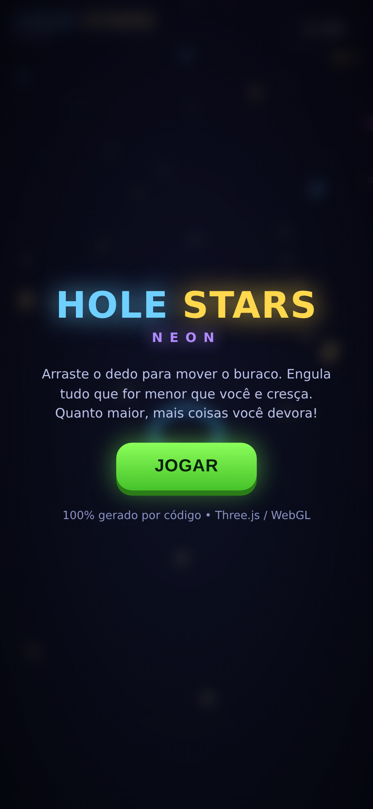
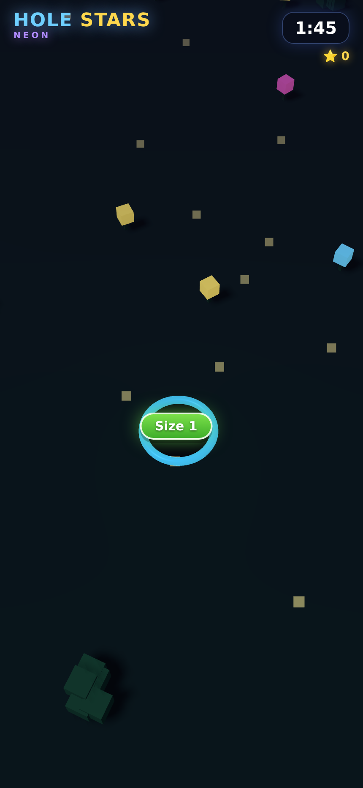

# 🕳️ Hole Stars — Neon

Jogo arcade 3D **"engula e cresça"** (estilo *Hole.io* / *Hole Stars*), com estética neon,
animações, partículas e controles touch. **100% gerado por código** (Three.js / WebGL) —
sem nenhum asset de artista. Toda a arte (árvores, casas, bichinhos, prédios) é construída
proceduralmente com voxels.

Este é o **primeiro protótipo da game farm**: um jogo simples, viciante e leve, do tipo que
publishers de hyper-casual testam aos montes.




---

## ▶️ Como jogar / rodar agora

Precisa rodar em um servidor HTTP (módulos ES não funcionam em `file://`):

```bash
cd game-farm/hole-stars
python3 -m http.server 8080
# abra http://localhost:8080 no navegador
# no celular (mesma rede Wi-Fi): http://SEU_IP:8080
```

**Controle:** arraste o dedo/mouse para mover o buraco. Engula tudo menor que você para crescer.
Quanto maior, mais coisas grandes você devora (flores → arbustos → árvores → bichos → casas → prédios).

---

## 📱 Baixar o APK e instalar no celular (RECOMENDADO)

O jogo já tem um **projeto Android nativo** (pasta `android/`) e um **GitHub Action** que
compila o `.apk` na nuvem — você não precisa instalar nada no seu PC.

**Passo a passo:**
1. No GitHub, vá na aba **Actions** → workflow **"Build Hole Stars APK"**.
2. Clique em **"Run workflow"** (ou ele roda sozinho quando este jogo muda).
3. Espere ~3-5 min ficar verde ✅.
4. Abra o run → seção **Artifacts** → baixe **`hole-stars-debug-apk`** (é um `.zip` com o `app-debug.apk` dentro).
5. Passe o `.apk` pro celular, toque pra instalar (ative *"Instalar apps de fontes desconhecidas"* quando pedir).
6. Pronto — o ícone **Hole Stars** aparece na sua gaveta de apps. 🎮

> APK *debug* é assinado com chave de debug e serve perfeitamente pra testar. Pra publicar na
> Play Store depois, geramos um `.aab` assinado (passo do roadmap).

## 📱 Outras formas de testar

### PWA (sem compilar)
No Chrome do Android, abra a URL do jogo → menu → *"Adicionar à tela inicial"*.

### Build local (se você tiver Android SDK no PC)
```bash
cd game-farm/hole-stars
npm install
npx cap sync android
cd android && ./gradlew assembleDebug
# APK em: android/app/build/outputs/apk/debug/app-debug.apk
```

### Caminho 3 — TWA / Bubblewrap (empacota a PWA na Play Store)
```bash
npm i -g @bubblewrap/cli
bubblewrap init --manifest https://SEU_DOMINIO/manifest.webmanifest
bubblewrap build
```

> Este ambiente de desenvolvimento **não tem Java/Android SDK**, por isso o `.apk` não foi
> compilado aqui — mas todo o scaffolding está pronto e os comandos acima geram o APK em
> qualquer máquina com o SDK (ou num CI / GitHub Action de build Android).

---

## 🧩 O que tem dentro (mecânicas implementadas)

- Mundo 3D voxel procedural (6 tipos de objeto em tiers de tamanho)
- Buraco que cresce conforme engole (curva de crescimento por "massa" absorvida)
- Física de "sucção": objetos próximos são puxados e caem girando no buraco
- Câmera que segue o buraco de cima, com *screen shake* ao crescer
- Partículas neon ao devorar, popups de pontos (`+N`), pill de "Size N" colada no buraco
- HUD: cronômetro (2:00), placar, tela de início e de fim de jogo com restart
- Iluminação noturna + glow neon (emissive/additive), névoa para profundidade
- Animação idle dos bichinhos
- Touch + mouse, responsivo, `safe-area` para notch

## 🛠️ Como foi testado
Renderizado em headless (Playwright + WebGL/SwiftShader). Sessão automatizada confirmou a
progressão sem bugs e **zero erros de console**. Um bug de spawn (objetos nascendo dentro do
buraco e inflando o placar) foi encontrado e corrigido.

---

## 🚜 Roadmap da Game Farm (próximos passos)

1. **Polir este** (som, juice extra, skins de buraco, ranking) e publicar como teste.
2. **Integrar anúncios** (AppLovin MAX / AdMob): interstitial entre partidas + rewarded ("dobre seu placar").
3. **Analytics** (eventos: tempo de sessão, retenção D1, tamanho médio) — decidir o que escalar pelos dados.
4. **Novos protótipos rápidos** reaproveitando este motor: trocar tema/objetos (cidade, espaço, comida).
5. **Loop de produção**: 1 protótipo a cada poucos dias → testar CPI com anúncio barato → escalar só os vencedores.

## 🧠 Stack
- **Three.js r160** (vendorizado em `vendor/` — funciona offline, ideal pra APK)
- HTML/CSS/JS puro, arquivo único `index.html`
- Capacitor (empacotamento Android), PWA manifest
